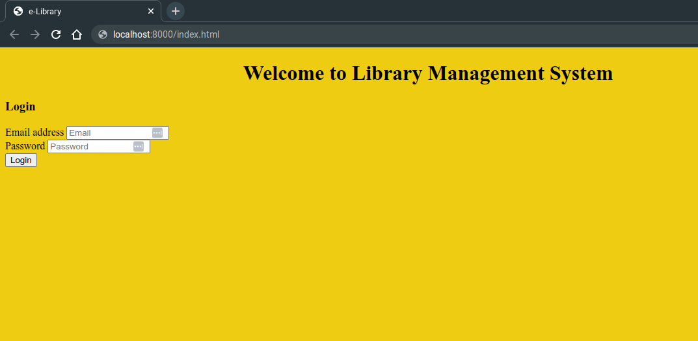
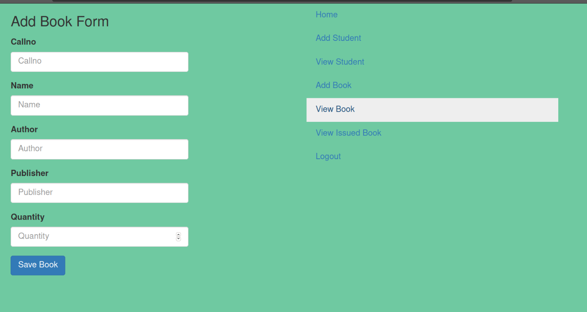
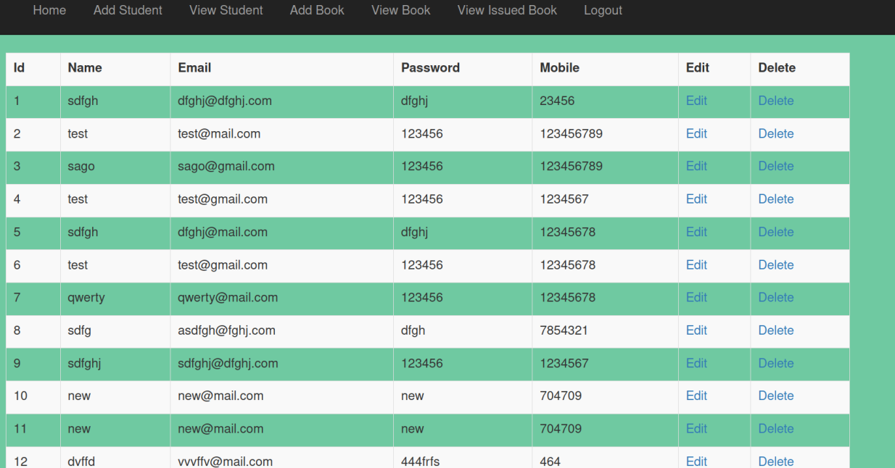

# Library Management System using Java Servlet

This repository contains Library Management System made using Java Servlet and jdbc. This project is made for the purpose of learning Servlet and jdbc. This Project is made under the Guidance of Akansha Moral Ma'am.

<center> Login Page</center>



<center> Add book</center>



<center> Student List</center>



## Description

The Project implements most used Concepts of Java i.e Polymorphism,Inheritance,Exception Handling, Collection Framework, Servlets and JDBC.

## Features

- Login and Logout
- Add Book
- Delete Book
- Issue Book
- Return Book
- Student List
- Book List
- Search Book
- Add Student
- Delete Student

## :arrow_down: Installation

- First, fork this repository :fork_and_knife: and follow the given instructions:

```bash
# clone the repository to your local machine
$ git clone https://github.com/<YOUR-GITHUB-USERNAME>/LIBRARYMANAGEMENT.git

# navigate to the project's directory and install all the relevant dev-dependencies
$ cd LIBRARYMANAGEMENT

# include all the latest changes from the remote repository
$ git remote add upstream https://github.com/parasguglani1/LIBRARYMANAGEMENT
$ git fetch upstream
$ git merge upstream/master
```

## Contact

[@parasguglani1](https://github.com/parasguglani1) is the sole author of this repository.
Feel free to contact me on [Linkedin](https://www.linkedin.com/in/parasguglani/) or [Mail](mailto:parasguglani1@gmail,com)
